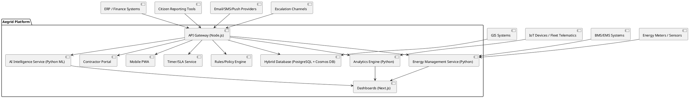
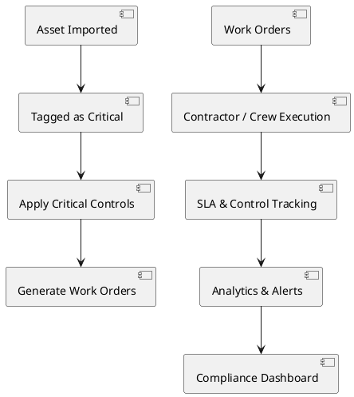

# Software Architecture Document (SAD)

Version: 0.2.0 (Draft)
Owner: Architecture Team
Last updated: 10/09/2025

- Related: `docs/architecture/service-concept.md`, `docs/architecture/service-blueprint.md`, `docs/security/rbac-implementation.md`, `docs/database/seed-implementation.md`, `docs/database/ERD.puml`, `docs/architecture/resource-naming-convention.md`, `docs/development/developer-brief.md`

## 1. Introduction

- **Purpose**: This document describes the architecture of **Aegrid**, the Asset Lifecycle Intelligence Platform. It provides resilient asset management following The Aegrid Rules, with signal-driven operations, resource management, and antifragile systems.
- **Scope**: Covers system goals, architecture overview, technology stack, integrations, deployment, and quality attributes, including **The Aegrid Rules** implementation, **Critical Control Theory (CCT)**, and **Resilience-First Architecture**.
- **Stakeholders**: Asset Managers, Works Supervisors, Fleet Coordinators, Council Executives, Councillors, Citizens, Contractors, IT Administrators.

## 2. Architectural Goals and Principles

- Implement **The Aegrid Rules** for resilient asset management: Every Asset Has a Purpose, Risk Sets the Rhythm, Respond to the Real World, Operate with Margin.
- Provide **resilience-first asset lifecycle management** with antifragile systems that improve under stress.
- Support **signal-driven operations** with real-time risk assessment and adaptive response.
- Embed **Critical Control Theory (CCT)** to guarantee execution of non-negotiable controls on critical assets, with escalation.
- Enable **resource management** with practical slack for absorbing shocks and enhancing resilience.
- **Energy Management Integration**: Core energy optimisation, metering, and carbon tracking as first-class module with BMS/EMS integration.
- **AI-Powered Intelligence**: Embedded optimisation algorithms, anomaly detection, and predictive maintenance as core system capabilities.
- **Hybrid Database Architecture**: PostgreSQL for transactional data and Azure Cosmos DB Gremlin API for graph-based asset intelligence.
- Ensure **integration** with ERP, GIS, citizen reporting, and energy management systems for comprehensive signal detection.
- Enable **scalable, multi-tenant SaaS** hosting with resilience-focused architecture.
- Maintain **security and compliance** with government standards and **ISO 55000** asset management requirements.
- Deliver **usability for field crews** (mobile-first, offline capable) with resilience-aware interfaces.
- Facilitate **continuous improvement** (modular upgrades, pilot-to-product pipeline) with antifragile design.
- **Resilience-First Architecture**: Antifragile systems, signal detection, resource management, adaptive response.
- **Mobile-first PWA** with offline capability, resilience-aware sync, and signal-driven updates.
- **Secure by default**: RBAC, audit logging, least privilege, input validation (Zod), resilience monitoring.
- **Interoperable**: Standards-based APIs, GIS via PostGIS/GeoJSON, ERP adapters, signal integration, BMS/EMS connectivity.
- **Observability**: structured logging, traces, metrics, health checks, resilience monitoring.
- **Regional alignment**: Australian English, DD/MM/YYYY, 24-hour time, AUD, metric units, Australian time zones and public holidays.

## 3. Context and Constraints

- Context: Multi-tenant SaaS for tiered councils; constrained budgets and mixed digital maturity.
- Regulatory: Records retention, privacy, accessibility (WCAG 2.1 AA), procurement.
- Performance: Field crews need fast, resilient offline-first behaviour; dashboards sub‑second for common views.
- Data residency: Prefer AU regions where applicable.
- Councils may have **legacy ERPs** with poor API support → need CSV import/export.
- Mobile devices in field may have **limited connectivity** → offline-first required.
- Procurement cycles are **slow** → must deliver value early with pilots/PoCs.

## 4. High-Level Architecture

### Core Components

- **Hybrid Database Architecture**: PostgreSQL with PostGIS for transactional data and Azure Cosmos DB Gremlin API for graph-based asset intelligence.
- **API Gateway**: Node.js for handling REST/GraphQL requests, authentication, and integrations.
- **Analytics Engine**: Python services for risk scoring, forecasting, predictive maintenance, and reporting.
- **Energy Management Module**: Core energy optimisation, metering integration, carbon tracking, and BMS/EMS connectivity.
- **AI Intelligence Engine**: Embedded optimisation algorithms, anomaly detection, predictive maintenance, and automated red-flagging.
- **Graph Intelligence Service**: Azure Cosmos DB Gremlin API for function-based asset modeling and relationship analysis.
- **Frontend**: React/Next.js dashboards for managers, executives, and councillors with enhanced visualisation (charts, gantts, graphs).
- **Mobile App (PWA)**: Offline-enabled inspections, work orders, and field data capture.
- **SLA & Service Lifecycle Management (SLM)**: Contract records, SLA definitions, vendor portal, SLA timers/alerts, evidence capture, and reporting.
- **Critical Controls Module (CCT)**: Identify critical assets, define control rules/windows, enforce execution/compliance, trigger escalations and dashboards.

### Integrations

- **ERP/Finance Systems** (Civica, TechOne): CapEx/OpEx, depreciation, financial workflows.
- **GIS Platforms** (ESRI, QGIS): Asset mapping and spatial overlays.
- **Energy Management Systems (BMS/EMS)**: Building automation, energy metering, HVAC optimisation, carbon tracking, real-time energy intelligence.
- **IoT/Telematics**: Fleet sensors, solar/battery performance feeds, energy consumption monitoring, environmental sensors.
- **Citizen Reporting Tools** (Snap Send Solve, APIs): Community-reported issues.
- **Vendor Communications**: Email/SMS/Push notifications for contractor assignment and SLA alerts.
- **Escalation Channels**: Email/SMS/Teams/Slack for critical control escalations and acknowledgements.

### Technical Implementation

- Frontend: Next.js (App Router) dashboards with enhanced visualisation (charts, gantts, graphs); PWA for field crews (offline cache, background sync).
- API Layer: Node.js (TypeScript) REST/GraphQL gateway; validation with Zod; authentication with NextAuth.js (JWT sessions) and RBAC.
- Analytics & Scheduling: Python services for RCM‑lite, forecasting, optimisation (containers, async jobs/worker queue).
- Energy Management: Python services for energy optimisation, BMS/EMS integration, carbon tracking, and energy analytics.
- AI Intelligence: Python ML services for anomaly detection, predictive maintenance, optimisation algorithms, and automated red-flagging.
- Hybrid Database: PostgreSQL + PostGIS for transactional data; Azure Cosmos DB Gremlin API for graph-based asset intelligence; Prisma ORM for app data access; Postgres RLS for tenant and role scoping.
- SLA Timers & Alerts: Scheduler/worker service tracks response/resolution windows; notifications on thresholds; idempotent state transitions on work orders.
- Critical Control Enforcement: Rules engine evaluates control windows (due-by, frequency, grace); generates tasks; escalates on breach/at-risk; immutable audit trail of acknowledgements and overrides.
- Integrations: Webhooks, adapters for ERP, citizen reporting portals, IoT, BMS/EMS systems; message queue for async tasks.
- Observability: OpenTelemetry traces, structured logs, metrics; dashboards and alerting.
- Deployment: Containers (Docker, Kubernetes/Azure Container Apps); environments: dev, test, prod.

### 4.1 C4: System Context (textual)

- Users: Council staff (Admin, Manager, Supervisor, Crew, Exec), Citizens, Vendors/Contractors (restricted portal access).
- External Systems: ERP, GIS (e.g. ArcGIS), Identity Provider (IdP), Email/SMS, File storage, IoT.
- Aegrid provides secure dashboards, APIs, mobile workflows, analytics, and reporting.

### 4.2 C4: Containers

- Web App (Next.js)
- Contractor Portal (restricted vendor UI)
- Mobile PWA
- API Gateway (Node.js)
- Worker/Analytics (Python)
- Hybrid Database (PostgreSQL + PostGIS + Azure Cosmos DB Gremlin API)
- Energy Management Service (Python)
- AI Intelligence Service (Python ML)
- Message Broker (e.g. RabbitMQ/Cloud queue)
- Object Storage (photos, documents)
- Identity Provider (OIDC/SAML) via NextAuth providers
- Timer/Scheduler Service (e.g. worker queue + scheduled jobs) for SLA tracking
- Rules/Policy Engine for CCT evaluation and escalation workflows

### 4.3 Logical View

## 5. Data Architecture

- Canonical identifiers: UUIDs; time kept in UTC in DB, displayed in local Australian time.
- Spatial: PostGIS geometry for assets; index on geography/geometry columns.
- Multi-tenancy: `organisation_id` on all tenant-scoped tables; enforced via Postgres RLS and application claims.
- Auditing: Created/updated timestamps, user IDs, change logs; immutable event trail for critical records.
- Contracts & SLAs: Entities for Vendor, Contract, SLA definitions; work orders reference contract/SLA; SLA status and timestamps (assigned, acknowledged, started, paused, completed) persisted with auditability.
- Critical Controls: Entities for `CriticalControl` (rule, window, frequency), `AssetCriticalControl` mapping, compliance records with timestamps and user/vendor IDs; escalation events stored immutably.
- Hybrid Database: PostgreSQL for transactional data; Azure Cosmos DB Gremlin API for graph-based asset relationships and function-based modeling.
- Data Synchronization: Real-time sync between PostgreSQL and Cosmos DB with conflict resolution and eventual consistency for graph relationships.
- Energy Data: Comprehensive energy consumption tracking, efficiency metrics, carbon emissions, and BMS/EMS integration.
- AI Data: Machine learning training data, model artifacts, prediction results, and feedback loops for continuous improvement.
- Backups & DR: PITR enabled; daily encrypted backups; tested restores.

## 6. Process View

- **Asset Import**: Bulk load from ERP/CSV → validate → stored in PostgreSQL → sync to Cosmos DB for graph relationships.
- **Maintenance Scheduling**: AI-powered templates applied → jobs auto-created → assigned to crews → optimised by ML algorithms.
- **Inspections**: Mobile PWA used in field (offline) → syncs to API → updates asset record → triggers AI analysis.
- **Citizen Reports**: API intake → normalised into work orders → linked to assets → AI-powered prioritisation.
- **Energy Management**: Real-time energy data ingestion → BMS/EMS integration → AI-powered optimisation → carbon tracking.
- **AI Intelligence**: Continuous data analysis → anomaly detection → predictive maintenance → automated red-flagging.
- **Graph Intelligence**: Function-based asset modeling → relationship analysis → multiple hierarchy support → future scenario planning.
- **Forecasting**: Analytics engine generates 10–20 year renewal models → AI-enhanced predictions → outputs dashboards.
- **Reporting**: Managers/execs generate compliance/audit reports → AI-generated insights → export PDF/Excel.
- **SLA Tracking**: On work order creation/assignment, SLA timers start; vendor acknowledgements stop response timer; resolution timer runs until closure; breaches trigger alerts and are logged for reporting.
- **Critical Control Enforcement**: Controls generated per schedule; at-risk prediction raises early alerts; overdue triggers escalation workflow (multi-channel) until acknowledged/resolved or formally overridden with justification.

## 6.1 Critical Assets & Controls View

### Data Model Additions

- `Asset.criticality_level` (High, Medium, Low).
- `CriticalControl.type` (Preventive, Reactive, Critical).
- `WorkOrder.sla_id` → link to SLA contract.
- `CriticalControl.status` (Compliant, Breach, Escalated).

### Enforcement Flow

### Integration

- RCM defines the maintenance strategy.
- CCT defines the non-negotiable tasks.
- SLA module ensures contractors deliver on time.
- Aegrid enforces compliance with escalation, alerts, and reports.

## 7. Security Architecture

- **Authentication**: OAuth2/JWT with council SSO (Azure AD/Okta).
- **Authorisation**: RBAC (Admin, Manager, Supervisor, Crew, Exec, Citizen, Vendor). Critical control configuration restricted to Manager/Admin; execution visibility to Supervisor; vendor only sees linked controls where contracted.
- **Data Protection**: AES-256 encryption at rest, TLS 1.3 in transit.
- **Monitoring**: Intrusion detection (Wazuh/OSSEC), audit logs immutable.
- MFA: Enforced for administrators and contractors/vendors.
- Authentication: NextAuth.js with JWT sessions; configurable providers; session expiry and refresh.
- Authorisation: Role-based (Admin, Manager, Supervisor, Crew, Exec, Citizen); hierarchical permissions; policy checks at API and UI; database RLS.
- Secrets: Managed via environment variables/secret manager; never committed.
- Input validation: Zod schemas at all API boundaries; output sanitisation for HTML.
- Passwords (if used): bcrypt 12 rounds; never stored in plain text.
- Transport: HTTPS everywhere; HSTS; secure cookies.
- Threat model: Covers auth bypass, multi-tenant data leakage, CSRF/XSS/SQLi, offline tampering, replay, broken access control.
  - SLA/Contract tampering risks mitigated via audit logs, signed URLs for evidence, and strict scope permissions for vendor users.
  - CCT risks mitigated through mandatory justification for overrides, multi-party acknowledgements, and immutable escalation trails.

## 8. Quality Attributes

- **Reliability**: Redundant services, automatic failover, backup/restore policies.
- **Security**: Role-based access control (RBAC), encryption at rest and in transit, penetration-tested APIs.
- **Performance**: Optimised queries (PostGIS indexing), scalable microservices.
- **Usability**: Mobile-first design, offline inspections, intuitive dashboards.
- **Interoperability**: Open APIs, standards-based integrations (OGC for GIS, REST/GraphQL for ERP).
- **Maintainability**: Modular microservices, versioned APIs, automated tests.
- **Auditability**: Full history of inspections, work orders, risk scores, and reporting logs.
  - SLA evidence logs: timestamped updates, GPS-stamped photos; exportable audit trails.
- Reliability: Zero-downtime deploys, health checks, circuit breakers, retries with backoff.
- Performance: API p95 < 300ms for common endpoints; dashboard p95 < 1s; large exports in async jobs.
- Scalability: Horizontal scaling for stateless services; DB read replicas as needed; caching layers.
- Usability: WCAG 2.1 AA; keyboard navigation; offline-friendly flows; clear error messaging.
- Observability: Trace > log > metric correlation; SLOs and alerting.
- Maintainability: Modular, typed, documented, ADRs for decisions, tests.
- Assurance: Critical controls tracked with near-real-time alerts and robust auditability for regulators.

## 9. Application Modules

- Asset Registry: import, CRUD, GIS view; attachments; graph-based relationships.
- RCM‑lite: templates, failure modes, tasks, risk scoring; generation policies; AI-enhanced scheduling.
- Scheduling: AI-powered preventive plans; work order creation and allocation; ML optimisation.
- Inspections (PWA): offline forms, photos, GPS tagging; sync resolution; AI analysis.
- Energy Management: real-time energy metering, AI-powered optimisation algorithms, carbon tracking, BMS/EMS integration.
- AI Intelligence: embedded anomaly detection, predictive maintenance, optimisation engines, automated red-flagging.
- Graph Intelligence: function-based asset modeling, relationship analysis, multiple hierarchy support.
- Reporting & Exports: AI-generated risk/compliance dashboards; audit-ready packs with enhanced visualisation.
- Integrations: Citizen intake API, ERP sync, IoT signals, BMS/EMS connectivity, energy meters.
- SLA & SLM: Contract management, vendor portal, SLA definitions, timers, alerts, compliance dashboards, exports.
- Critical Controls: Control configuration, asset mapping, enforcement engine, escalations, compliance dashboards.

## 9.1 ISO 55000 Compliance Framework

### Mapping Aegrid Rules to ISO 55000 Principles

**ISO 55000 Value Principle**: Every Asset Has a Purpose

- Asset purpose mapping and service delivery tracking
- Value contribution analysis and reporting
- Strategic alignment with organisational objectives

**ISO 55000 Alignment Principle**: Risk Sets the Rhythm

- Risk-based maintenance scheduling aligned with criticality
- Asset criticality assessment and management
- Failure mode analysis and mitigation strategies

**ISO 55000 Assurance Principle**: Respond to the Real World

- Real-time signal detection and adaptive response
- Critical control enforcement and escalation
- Compliance monitoring and audit trails

**ISO 55000 Leadership Principle**: Operate with Margin

- Resource management for operational resilience
- Antifragile system design and continuous improvement
- Organisational learning and capability development

### ISO 55000 Implementation Requirements

- **Asset Management Policy**: Documented alignment with organisational strategy
- **Strategic Asset Management Plan**: Long-term asset lifecycle planning
- **Asset Management Objectives**: Measurable targets for asset performance
- **Asset Management System**: Integrated processes for asset lifecycle management
- **Performance Evaluation**: Regular assessment against ISO 55000 requirements
- **Improvement**: Continuous enhancement of asset management capabilities

## 10. Deployment & Environments

- **Cloud Hosting**: AWS/Azure/GCP multi-region support.
- **Containerisation**: Docker and Kubernetes for portability.
- **Multi-Tenancy**: Each council operates as a tenant with isolated data.
- **CI/CD**: GitHub Actions for automated build, test, and deployment.
- **Monitoring**: Prometheus + Grafana for system health; ELK stack for logs.
- Dev: feature branches; preview deployments.
- Test: integration and UAT; seeded realistic data.
- Prod: AU region; blue/green or rolling deploy; mandatory monitoring.
- Configuration via env vars; secrets from secret store; infra as code.

### 10.1 Development View

- **Repositories**: Monorepo (pnpm workspaces or TurboRepo) for consistent dev practices.
- **Branching Strategy**: GitFlow (feature/\*, develop, main).
- **Testing**: Unit (Jest/PyTest), Integration (Postman/Newman), E2E (Playwright).
- **Infrastructure as Code**: Terraform or Pulumi for environment provisioning.
- **Container Registry**: Images stored in GHCR/ECR.

### 10.2 Physical View

- **Environments**: Dev → Test → UAT → Prod.
- **Hosting**: Cloud-native Kubernetes clusters.
- **Networking**: Secure VPC, service mesh (Istio/Linkerd).
- **Storage**: S3/Blob for media (photos, reports), Postgres for relational data.

## 11. Observability

- OpenTelemetry SDK across Node and Python services.
- Log format: JSON, correlation IDs, user/tenant IDs where appropriate.
- Dashboards: performance, error rates, sync lag, job queues, GIS query times.
- SLA Metrics: response/resolution time percentiles, active timers, imminent breaches, vendor compliance %, contract health scores.
- CCT Metrics: control compliance %, time-at-risk, mean time to acknowledge/resolve, escalations by severity, overrides with justifications.

## 12. Compliance & Governance

- Privacy and records management; data classification.
- Access reviews; least privilege; joiner/mover/leaver processes.
- Change management with documented ADRs and changelog.

## 13. Risks and Mitigations

- Offline conflicts: implement CRDT/last-write-wins with user prompts; server-side merge policies.
- Spatial performance: appropriate indexes; tile-based rendering; caching.
- Integration fragility: retries, DLQs, idempotency keys.
- Multi-tenant leakage: defence in depth (claims, RLS, tests).

## 14. Future Enhancements

- **Advanced AI Predictive Maintenance**: Enhanced ML models with deeper fleet and IoT data integration.
- **Sustainability Module**: Comprehensive carbon impact tracking and ESG reporting.
- **Benchmarking Service**: Anonymised cross-council performance comparisons.
- **Digital Twin Integration**: Optional module for advanced councils with 3D asset modelling.
- **Advanced Energy Optimisation**: Machine learning-driven energy consumption optimisation.
- **Predictive Analytics**: Enhanced forecasting for asset lifecycle and maintenance needs.
- **Graph Intelligence Expansion**: Advanced graph algorithms for complex asset relationship analysis.
- **Hybrid Database Optimisation**: Enhanced synchronization and performance optimization between PostgreSQL and Cosmos DB.
- **AI-Powered Decision Support**: Advanced decision support systems with explainable AI and confidence scoring.

## 15. Open Decisions (ADRs)

- ADR-001: Queue technology (Managed vs self-hosted).
- ADR-002: GraphQL vs REST for internal APIs.
- ADR-003: Mobile packaging (pure PWA vs optional wrapper).
- ADR-004: GIS library choice for web map rendering.

## 16. Glossary

- **RCM‑lite**: Simplified Reliability-Centred Maintenance.
- **RLS**: Row-Level Security (Postgres).
- **PWA**: Progressive Web App.
- **SLO/SLA**: Service Level Objective/Agreement.
- **BMS**: Building Management System.
- **EMS**: Energy Management System.
- **AI Intelligence**: Embedded optimisation algorithms, anomaly detection, and predictive maintenance.
- **Energy Optimisation**: Continuous monitoring and optimisation of energy consumption and efficiency.
- **ISO 55000**: International standard for asset management systems.
- **Standards Referenced**: OGC GIS standards, ISO 55000 (asset management), WCAG 2.1 AA (accessibility).
- **Glossary**: RCM-lite, FMEA, PoC, CapEx, OpEx, GIS, ERP, BMS, EMS.
