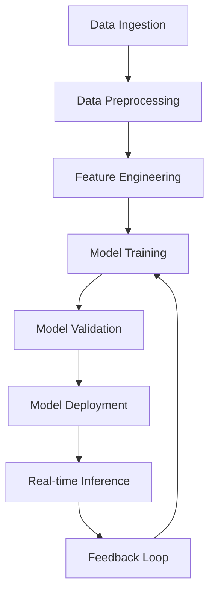

# AI Intelligence Module Architecture

Version: 1.0.0 (Draft)
Owner: Architecture Team
Last updated: 23/09/2025

Related: `docs/architecture/SAD.md`, `docs/research/interviews/uts-property-director-demo-2025-09-23.md`

## 1. Introduction

### Purpose
This document describes the architecture of the **AI Intelligence Module** for Aegrid, addressing the critical client feedback that AI must be embedded at the core of the system, not treated as a "nice-to-have" add-on.

### Scope
Covers embedded optimisation algorithms, anomaly detection, predictive maintenance, automated red-flagging, and AI-powered decision support as core system capabilities.

### Stakeholders
Asset Managers, Facilities Directors, Operations Managers, Maintenance Supervisors, Council Executives.

## 2. Module Goals and Principles

- **Embedded Intelligence**: AI capabilities are core system features, not optional modules
- **Optimisation-First**: Continuous optimisation of asset performance and operations
- **Predictive Analytics**: Proactive identification and resolution of issues
- **Automated Decision Support**: AI-driven recommendations and automated actions
- **Real-time Intelligence**: Continuous monitoring and adaptive response
- **Human-AI Collaboration**: AI augments human decision-making, doesn't replace it
- **Transparent AI**: Explainable AI decisions with clear reasoning and confidence scores

## 3. Core AI Components

### 3.1 Optimisation Engine
- **Asset Performance Optimisation**: Continuous improvement of asset efficiency
- **Maintenance Scheduling Optimisation**: AI-driven scheduling for maximum efficiency
- **Resource Allocation**: Intelligent allocation of crews, equipment, and materials
- **Energy Optimisation**: AI-powered energy consumption minimisation
- **Cost Optimisation**: Financial efficiency improvements across operations
- **Risk Optimisation**: Balancing risk mitigation with operational efficiency

### 3.2 Anomaly Detection System
- **Pattern Recognition**: Machine learning models to identify unusual patterns
- **Statistical Anomaly Detection**: Statistical methods for outlier identification
- **Behavioural Analysis**: Understanding normal vs. abnormal asset behaviour
- **Multi-dimensional Analysis**: Cross-correlating multiple data sources
- **Real-time Detection**: Immediate identification of anomalies as they occur
- **Adaptive Learning**: Models that improve over time with new data

### 3.3 Predictive Maintenance Intelligence
- **Failure Prediction**: ML models to predict equipment failures before they occur
- **Condition Monitoring**: Continuous assessment of asset condition
- **Remaining Useful Life**: Estimation of asset lifespan and maintenance needs
- **Maintenance Optimisation**: Optimal timing and type of maintenance activities
- **Spare Parts Prediction**: Forecasting of spare parts requirements
- **Downtime Minimisation**: Reducing unplanned downtime through prediction

### 3.4 Automated Red-flagging System
- **Risk Assessment**: Continuous evaluation of asset and operational risks
- **Alert Generation**: Automated creation of alerts for critical issues
- **Priority Scoring**: AI-driven prioritisation of issues and tasks
- **Escalation Logic**: Intelligent escalation based on risk and impact
- **Exception Handling**: Automated handling of routine exceptions
- **Compliance Monitoring**: Continuous monitoring of regulatory compliance

## 4. AI Architecture

### 4.1 Machine Learning Pipeline


### 4.2 AI Service Architecture
```typescript
interface AIServices {
  optimisation: {
    assetPerformance: OptimisationEngine;
    maintenanceScheduling: SchedulingOptimiser;
    resourceAllocation: ResourceOptimiser;
    energyEfficiency: EnergyOptimiser;
  };
  intelligence: {
    anomalyDetection: AnomalyDetector;
    predictiveMaintenance: PredictiveEngine;
    riskAssessment: RiskAnalyzer;
    decisionSupport: DecisionEngine;
  };
  automation: {
    redFlagging: AlertSystem;
    escalation: EscalationEngine;
    exceptionHandling: ExceptionHandler;
    compliance: ComplianceMonitor;
  };
}
```

## 5. Machine Learning Models

### 5.1 Predictive Maintenance Models
```python
class PredictiveMaintenanceModel:
    """Predictive maintenance using multiple ML approaches"""

    def __init__(self):
        self.failure_prediction = RandomForestClassifier()
        self.condition_assessment = LSTM()
        self.lifespan_estimation = LinearRegression()
        self.maintenance_optimisation = ReinforcementLearning()

    def predict_failure(self, asset_data: AssetData) -> FailurePrediction:
        """Predict likelihood of asset failure"""
        pass

    def assess_condition(self, sensor_data: SensorData) -> ConditionScore:
        """Assess current asset condition"""
        pass

    def estimate_lifespan(self, historical_data: HistoricalData) -> LifespanEstimate:
        """Estimate remaining useful life"""
        pass
```

### 5.2 Anomaly Detection Models
```python
class AnomalyDetectionSystem:
    """Multi-layered anomaly detection system"""

    def __init__(self):
        self.isolation_forest = IsolationForest()
        self.autoencoder = Autoencoder()
        self.statistical_detector = StatisticalDetector()
        self.ensemble_detector = EnsembleDetector()

    def detect_anomalies(self, data_stream: DataStream) -> AnomalyReport:
        """Detect anomalies in real-time data streams"""
        pass

    def explain_anomaly(self, anomaly: Anomaly) -> Explanation:
        """Provide human-readable explanation of anomaly"""
        pass
```

### 5.3 Optimisation Algorithms
```python
class OptimisationEngine:
    """Multi-objective optimisation engine"""

    def __init__(self):
        self.genetic_algorithm = GeneticAlgorithm()
        self.particle_swarm = ParticleSwarmOptimization()
        self.simulated_annealing = SimulatedAnnealing()
        self.reinforcement_learning = QLearning()

    def optimise_maintenance_schedule(self, constraints: Constraints) -> Schedule:
        """Optimise maintenance scheduling"""
        pass

    def optimise_resource_allocation(self, resources: Resources) -> Allocation:
        """Optimise resource allocation"""
        pass
```

## 6. Data Requirements

### 6.1 Training Data
- **Historical Asset Data**: Performance, maintenance, and failure records
- **Sensor Data**: IoT sensor readings from assets and equipment
- **Environmental Data**: Weather, usage patterns, and operational conditions
- **Maintenance Records**: Work orders, inspections, and repair history
- **Cost Data**: Financial impact of maintenance and failures
- **Energy Data**: Energy consumption and efficiency metrics

### 6.2 Real-time Data Streams
- **IoT Sensors**: Continuous sensor data from assets
- **Operational Data**: Real-time operational parameters
- **Environmental Data**: Current environmental conditions
- **System Logs**: Application and system performance data
- **User Interactions**: User actions and system usage patterns

## 7. API Endpoints

### 7.1 AI Intelligence APIs
```typescript
// Predictive maintenance
POST /api/ai/predictive-maintenance/predict
GET /api/ai/predictive-maintenance/models
POST /api/ai/predictive-maintenance/retrain

// Anomaly detection
POST /api/ai/anomaly-detection/detect
GET /api/ai/anomaly-detection/history
POST /api/ai/anomaly-detection/feedback

// Optimisation
POST /api/ai/optimisation/schedule
POST /api/ai/optimisation/allocate
POST /api/ai/optimisation/energy
GET /api/ai/optimisation/recommendations

// Automated red-flagging
GET /api/ai/alerts/active
POST /api/ai/alerts/acknowledge
GET /api/ai/alerts/escalation-status
```

### 7.2 Real-time AI Services
```typescript
// WebSocket endpoints for real-time AI
WS /ws/ai/predictions
WS /ws/ai/anomalies
WS /ws/ai/optimisations
WS /ws/ai/alerts
```

## 8. User Interface Components

### 8.1 AI Dashboard
- **Predictive Insights**: Future asset performance predictions
- **Anomaly Alerts**: Real-time anomaly notifications and explanations
- **Optimisation Recommendations**: AI-driven improvement suggestions
- **Confidence Scores**: AI decision confidence and uncertainty indicators
- **Model Performance**: AI model accuracy and performance metrics

### 8.2 Intelligent Workflows
- **Smart Scheduling**: AI-optimised maintenance scheduling interface
- **Intelligent Inspections**: AI-guided inspection workflows
- **Automated Reporting**: AI-generated reports and insights
- **Decision Support**: AI-assisted decision-making interfaces

## 9. Implementation Strategy

### 9.1 Phased Rollout
**Phase 1: Foundation**
- Basic anomaly detection
- Simple optimisation algorithms
- Predictive maintenance models
- Automated alerting

**Phase 2: Intelligence**
- Advanced ML models
- Multi-objective optimisation
- Explainable AI features
- Advanced analytics

**Phase 3: Automation**
- Full automation capabilities
- Self-improving systems
- Advanced decision support
- Complete AI integration

### 9.2 Model Development Process
1. **Data Collection**: Gather historical and real-time data
2. **Model Development**: Develop and train ML models
3. **Validation**: Validate models with test data
4. **Deployment**: Deploy models to production
5. **Monitoring**: Monitor model performance
6. **Improvement**: Continuously improve models

## 10. Quality Assurance

### 10.1 Model Validation
- **Cross-validation**: K-fold cross-validation for model accuracy
- **Holdout Testing**: Separate test set for final validation
- **A/B Testing**: Compare model performance against baseline
- **Performance Metrics**: Accuracy, precision, recall, F1-score
- **Business Metrics**: Impact on operational efficiency and costs

### 10.2 Continuous Monitoring
- **Model Drift Detection**: Monitor for model performance degradation
- **Data Quality Monitoring**: Ensure input data quality
- **Performance Monitoring**: Track model inference performance
- **Feedback Integration**: Incorporate user feedback for model improvement

## 11. Security and Privacy

### 11.1 Data Protection
- **Data Encryption**: Encrypt sensitive data in transit and at rest
- **Access Controls**: Role-based access to AI models and data
- **Audit Logging**: Comprehensive logging of AI decisions and actions
- **Privacy Preservation**: Protect sensitive asset and operational data

### 11.2 AI Security
- **Model Protection**: Secure AI models from tampering
- **Input Validation**: Validate inputs to prevent adversarial attacks
- **Output Sanitisation**: Sanitise AI outputs for security
- **Explainability**: Ensure AI decisions are explainable and auditable

## 12. Success Metrics

### 12.1 AI Performance Metrics
- **Prediction Accuracy**: Accuracy of predictive models
- **Anomaly Detection Rate**: Percentage of anomalies correctly identified
- **Optimisation Improvement**: Measurable improvement in operational efficiency
- **Response Time**: Speed of AI inference and decision-making

### 12.2 Business Impact Metrics
- **Cost Reduction**: Financial savings from AI optimisation
- **Downtime Reduction**: Reduction in unplanned downtime
- **Efficiency Improvement**: Operational efficiency gains
- **User Adoption**: User engagement with AI features

## 13. Related Documentation

- `docs/architecture/SAD.md` — Main system architecture
- `docs/architecture/energy-management-module.md` — Energy optimisation integration
- `docs/research/interviews/uts-property-director-demo-2025-09-23.md` — Client feedback analysis
