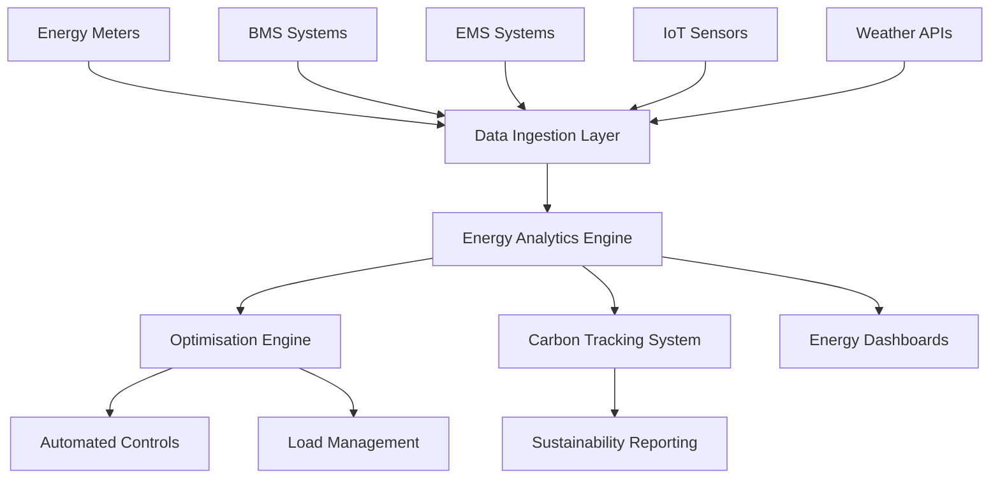

# Energy Management Module Architecture

Version: 1.0.0 (Draft)
Owner: Architecture Team
Last updated: 23/09/2025

Related: `docs/architecture/SAD.md`, `docs/research/interviews/uts-property-director-demo-2025-09-23.md`

## 1. Introduction

### Purpose
This document describes the architecture of the **Energy Management Module** for Aegrid, addressing the critical gap identified in client feedback. Energy optimisation is a non-negotiable requirement for property and facilities management, not an optional add-on.

### Scope
Covers energy metering, optimisation algorithms, carbon tracking, BMS/EMS integration, and real-time energy intelligence as core system capabilities.

### Stakeholders
Asset Managers, Energy Managers, Facilities Directors, Sustainability Officers, Council Executives.

## 2. Module Goals and Principles

- **Energy Optimisation as Core**: Energy management is a first-class module, not a bolt-on feature
- **Real-time Intelligence**: Continuous monitoring and optimisation of energy consumption
- **BMS/EMS Integration**: Seamless connectivity with building and energy management systems
- **Carbon Tracking**: Comprehensive environmental impact monitoring and reporting
- **Predictive Energy Analytics**: AI-driven energy consumption forecasting and optimisation
- **Cost Optimisation**: Financial impact analysis of energy decisions
- **Compliance Reporting**: Energy efficiency standards and regulatory compliance

## 3. Core Components

### 3.1 Energy Data Ingestion
- **Meter Integration**: Real-time energy consumption data from various meter types
- **BMS Connectivity**: Building Management System integration for HVAC, lighting, and equipment
- **EMS Integration**: Energy Management System connectivity for renewable energy and storage
- **IoT Sensors**: Environmental sensors for temperature, humidity, occupancy, and energy usage
- **Weather Data**: External weather API integration for energy consumption correlation

### 3.2 Energy Analytics Engine
- **Consumption Analysis**: Historical and real-time energy usage patterns
- **Efficiency Scoring**: Asset energy efficiency ratings and benchmarks
- **Anomaly Detection**: AI-powered identification of unusual energy consumption patterns
- **Optimisation Algorithms**: Machine learning-driven energy consumption optimisation
- **Predictive Modelling**: Energy demand forecasting and capacity planning
- **Cost Analysis**: Energy cost tracking and financial impact assessment

### 3.3 Carbon Tracking System
- **Emission Calculations**: Carbon footprint calculation based on energy consumption
- **Scope 1, 2, 3 Tracking**: Comprehensive greenhouse gas emission monitoring
- **Sustainability Reporting**: ESG compliance and sustainability dashboard
- **Carbon Reduction Planning**: Goal setting and progress tracking for emissions reduction
- **Renewable Energy Integration**: Solar, wind, and other renewable energy tracking

### 3.4 Energy Optimisation Engine
- **Automated Controls**: AI-driven optimisation of HVAC, lighting, and equipment schedules
- **Load Balancing**: Intelligent distribution of energy loads across assets
- **Peak Demand Management**: Load shedding and demand response optimisation
- **Equipment Efficiency**: Maintenance scheduling based on energy performance
- **Energy Storage Optimisation**: Battery and thermal storage system management

## 4. Integration Architecture

### 4.1 BMS/EMS Connectivity
```typescript
interface EnergySystemIntegration {
  bms: {
    hvac: HVACControlSystem;
    lighting: LightingControlSystem;
    equipment: EquipmentMonitoringSystem;
  };
  ems: {
    renewable: RenewableEnergySystem;
    storage: EnergyStorageSystem;
    grid: GridConnectionSystem;
  };
  meters: {
    electricity: ElectricityMeter[];
    gas: GasMeter[];
    water: WaterMeter[];
  };
}
```

### 4.2 Data Flow Architecture


## 5. Database Schema

### 5.1 Energy Data Tables
```sql
-- Energy consumption records
CREATE TABLE energy_consumption (
    id UUID PRIMARY KEY,
    asset_id UUID REFERENCES assets(id),
    meter_id UUID REFERENCES energy_meters(id),
    consumption_value DECIMAL(10,4),
    consumption_unit VARCHAR(10),
    timestamp TIMESTAMP WITH TIME ZONE,
    created_at TIMESTAMP WITH TIME ZONE DEFAULT NOW()
);

-- Energy efficiency metrics
CREATE TABLE energy_efficiency_metrics (
    id UUID PRIMARY KEY,
    asset_id UUID REFERENCES assets(id),
    efficiency_score DECIMAL(5,2),
    benchmark_score DECIMAL(5,2),
    carbon_intensity DECIMAL(10,4),
    cost_per_unit DECIMAL(10,4),
    measurement_period_start TIMESTAMP WITH TIME ZONE,
    measurement_period_end TIMESTAMP WITH TIME ZONE,
    created_at TIMESTAMP WITH TIME ZONE DEFAULT NOW()
);

-- Carbon emissions tracking
CREATE TABLE carbon_emissions (
    id UUID PRIMARY KEY,
    asset_id UUID REFERENCES assets(id),
    scope_1_emissions DECIMAL(10,4),
    scope_2_emissions DECIMAL(10,4),
    scope_3_emissions DECIMAL(10,4),
    total_emissions DECIMAL(10,4),
    emission_factor DECIMAL(10,6),
    measurement_period TIMESTAMP WITH TIME ZONE,
    created_at TIMESTAMP WITH TIME ZONE DEFAULT NOW()
);
```

## 6. API Endpoints

### 6.1 Energy Data APIs
```typescript
// Energy consumption data
GET /api/energy/consumption/{assetId}
POST /api/energy/consumption
PUT /api/energy/consumption/{id}

// Energy efficiency metrics
GET /api/energy/efficiency/{assetId}
POST /api/energy/efficiency/calculate
GET /api/energy/efficiency/benchmarks

// Carbon tracking
GET /api/energy/carbon/{assetId}
POST /api/energy/carbon/calculate
GET /api/energy/carbon/report

// Energy optimisation
POST /api/energy/optimise/{assetId}
GET /api/energy/optimise/status/{jobId}
POST /api/energy/optimise/controls
```

### 6.2 Real-time Energy Intelligence
```typescript
// WebSocket endpoints for real-time data
WS /ws/energy/consumption/{assetId}
WS /ws/energy/alerts
WS /ws/energy/optimisation-status
```

## 7. AI and Machine Learning

### 7.1 Energy Optimisation Algorithms
- **Predictive Maintenance**: Energy-based equipment failure prediction
- **Load Forecasting**: Energy demand prediction for capacity planning
- **Anomaly Detection**: Identification of unusual energy consumption patterns
- **Optimisation Models**: Machine learning-driven energy efficiency improvements
- **Cost Optimisation**: Energy cost minimisation algorithms

### 7.2 Real-time Intelligence
- **Continuous Monitoring**: 24/7 energy consumption monitoring
- **Automated Alerts**: Real-time notifications for energy anomalies
- **Dynamic Optimisation**: Continuous adjustment of energy systems
- **Predictive Analytics**: Future energy consumption forecasting

## 8. User Interface Components

### 8.1 Energy Dashboards
- **Real-time Energy Consumption**: Live energy usage displays
- **Efficiency Metrics**: Energy efficiency scores and benchmarks
- **Carbon Footprint**: Environmental impact visualisation
- **Cost Analysis**: Energy cost tracking and financial impact
- **Optimisation Recommendations**: AI-driven energy improvement suggestions

### 8.2 Mobile Energy Management
- **Field Energy Monitoring**: Mobile energy consumption tracking
- **Energy Inspection Forms**: Energy efficiency assessment tools
- **Optimisation Controls**: Mobile access to energy system controls
- **Alert Management**: Energy anomaly notifications and responses

## 9. Compliance and Standards

### 9.1 Energy Standards
- **ISO 50001**: Energy management systems
- **ISO 14001**: Environmental management systems
- **Green Building Standards**: LEED, BREEAM, Green Star
- **Energy Efficiency Regulations**: Local and national energy efficiency requirements

### 9.2 Reporting Requirements
- **Sustainability Reporting**: ESG compliance and reporting
- **Energy Audits**: Regular energy efficiency assessments
- **Carbon Reporting**: Greenhouse gas emission reporting
- **Regulatory Compliance**: Energy efficiency regulatory compliance

## 10. Implementation Roadmap

### Phase 1: Core Energy Data (MVP)
- Energy meter integration
- Basic consumption tracking
- Energy efficiency calculations
- Simple dashboards

### Phase 2: Intelligence and Optimisation
- AI-powered anomaly detection
- Predictive energy analytics
- Automated optimisation controls
- Advanced visualisation

### Phase 3: Advanced Integration
- Full BMS/EMS integration
- Carbon tracking and reporting
- Sustainability management
- Advanced ML models

## 11. Success Metrics

### 11.1 Energy Performance
- Energy consumption reduction percentage
- Energy efficiency improvement scores
- Carbon emission reduction metrics
- Cost savings from energy optimisation

### 11.2 System Performance
- Real-time data processing latency
- Optimisation algorithm accuracy
- System uptime and reliability
- User adoption and engagement

## 12. Related Documentation

- `docs/architecture/SAD.md` — Main system architecture
- `docs/research/interviews/uts-property-director-demo-2025-09-23.md` — Client feedback analysis
- `docs/compliance/iso-standards-mapping.md` — ISO compliance requirements
