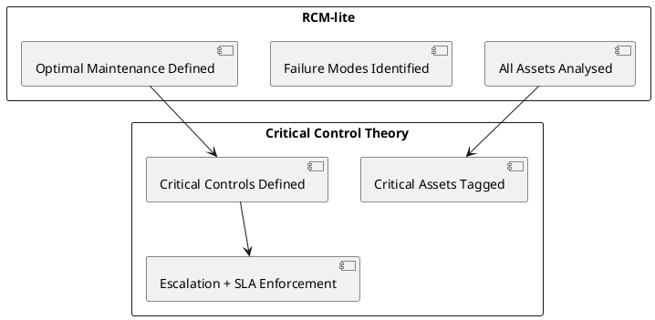

# Service Concept – Aegrid

## Purpose

Aegrid is the flagship product of GridWorks, designed to help local governments move beyond static asset registers and complex ERP modules. It provides a dedicated intelligence layer for asset lifecycle management, giving councils practical tools to extend asset life, reduce risk, and demonstrate accountability to their communities.

---

## Problem Statement

- Councils are responsible for **hundreds of billions of dollars in public assets**, from roads and drains to playgrounds, libraries, EV fleets, and solar farms.
- Many rely on **fragmented systems**: outdated spreadsheets, legacy ERP modules, or static registers.
- Audit reports (QAO, VAGO, etc.) show that most councils fall short on **asset planning, risk management, and reporting maturity**.
- Communities expect **greater transparency** on how their rates are used, but resources are tight.

The result: **reactive maintenance, inefficient spending, audit risk, and public frustration.**

---

## Service Proposition

**Aegrid delivers proactive, connected asset lifecycle intelligence.**
It unifies registers, risk models, work orders, inspections, and forecasting in a single SaaS platform built specifically for councils.

### Key Capabilities

1. **Asset Register + GIS** – Import assets from ERP/CSV and visualise them spatially with PostGIS integration.
2. **RCM-lite Templates** – Preloaded maintenance models for the top 10 council asset classes (roads, trucks, playgrounds, drains, lighting, parks, etc.).
3. **Preventive Maintenance Scheduling** – AI-powered work orders based on risk, condition, and lifecycle stage.
4. **Mobile Inspections (PWA)** – Crews log inspections, update condition, and upload photos offline.
5. **Citizen Report Integration** – Issues reported via Snap Send Solve or native portal flow directly into work order queues.
6. **Risk & Compliance Dashboards** – Managers and executives access visual dashboards and export audit-ready packs.
7. **Forecasting & Renewal Planning** – AI-enhanced analytics engine models CapEx/OpEx trade-offs and long-term renewal plans.
8. **SLA & Contractor Management** – Track service-level agreements for outsourced providers (mowing, graffiti removal, mechanics).
9. **Critical Assets & Controls (CCT Integration)** – Identify high-risk assets and enforce non-negotiable critical controls.
10. **Energy Management** – Core energy optimisation, BMS/EMS integration, carbon tracking, and real-time energy intelligence.
11. **AI Intelligence** – Embedded optimisation algorithms, anomaly detection, predictive maintenance, and automated red-flagging.
12. **Graph Intelligence** – Function-based asset modeling, relationship analysis, and multiple hierarchy support.
13. **Hybrid Database Architecture** – PostgreSQL for transactional data and Azure Cosmos DB Gremlin API for graph-based asset intelligence.
14. **Future Enhancements (Phase 2+)** – Advanced predictive maintenance from IoT/fleet telemetry, sustainability/carbon tracking, benchmarking, and digital twin integration.

---

## Technical Architecture

### Core Technology Stack

- **Frontend**: Next.js (App Router) with React components and PWA capabilities
- **Backend**: Node.js API Gateway with TypeScript and Python analytics services
- **Hybrid Database**: PostgreSQL + PostGIS for transactional data and Azure Cosmos DB Gremlin API for graph intelligence
- **Energy Management**: Python services for BMS/EMS integration and energy optimisation
- **AI Intelligence**: Python ML services for anomaly detection, predictive maintenance, and automated red-flagging
- **Authentication**: NextAuth.js with OAuth2/SSO integration
- **Mobile**: Progressive Web App (PWA) with offline capabilities
- **Integrations**: REST APIs, webhooks, and message queues for external systems

### Key Architectural Principles

- **Resilience-First**: Antifragile systems that improve under stress
- **Signal-Driven Operations**: Real-time risk assessment and adaptive response
- **Function-Based Asset Modeling**: Assets organized by service purpose using graph relationships
- **AI-Powered Intelligence**: Embedded optimisation algorithms and predictive analytics
- **Energy Management Integration**: Core energy optimisation and carbon tracking
- **Hybrid Database Architecture**: Best of both relational and graph database capabilities

---

Aegrid combines **Reliability-Centred Maintenance (RCM-lite)** and **Critical Control Theory (CCT)** into a unified framework:

### How It Works

1. **RCM-lite** identifies the right mix of preventive, reactive, and condition-based maintenance for all assets.
2. **Critical Control Theory overlay** elevates certain tasks as _critical controls_ for high-risk assets (e.g. bridge inspection, dam safety audit).
3. These controls are enforced by Aegrid with **SLA tracking, escalation alerts, and compliance dashboards**.

4. **SLA & Service Lifecycle Management (SLM)**
   Manage outsourced services and contractor performance within Aegrid.
   - SLA definition at contract level with parameters (response, resolution, frequency, cost model).
   - Contract records: vendor details, term dates, scope, alerts for expiry/renewal.
   - Vendor portal access with restricted RBAC to view/complete assigned work orders, upload evidence (photos, notes, invoices).
   - Automated SLA tracking on work orders with timers, visual indicators (met/breached), and manager alerts.
   - Reporting and audits: compliance dashboards per vendor, exportable packs, timestamped evidence logs with GPS photos.
   - Lifecycle integration: SLA compliance feeds asset health scoring and renewal forecasts.

---

## Service Boundaries

- **Not an ERP**: Works alongside existing finance systems (Civica, TechOne).
- **Not a CRM**: Focuses on assets, not customer relationships.
- **Not just reporting**: Operational execution (work orders, inspections, SLA management) is core.

---

## Benefits for Councils

### Strategic

- Extend asset life, optimise renewal cycles.
- Identify and manage **critical assets** (bridges, weirs, playgrounds).
- Provide clear evidence for audits and funding bids.
- Benchmark against other councils.

### Operational

- Reduce downtime and reactive maintenance.
- Enforce SLAs for contractors.
- Guarantee **100% compliance** for critical controls.
- Streamline crew work allocation and inspections.

### Community

- Improve transparency with "you said / we did" dashboards.
- Increase safety and service reliability.
- Support sustainability and climate commitments.

---

## Service Model

- **Subscription SaaS** – tiered by asset volume, with optional add-ons (citizen reporting, sustainability, AI predictive modules).
- **Implementation Services** – discovery, data migration, RCM template tailoring, critical control configuration, training.
- **Continuous Updates** – frequent feature releases via secure CI/CD pipeline.
- **Support** – service desk, knowledge base, customer success managers.

---

## Service Delivery Approach

- **Discovery Phase** – Import data, configure templates, identify critical assets, map workflows.
- **Pilot Phase** – Run a 12-week trial on one asset class (e.g. fleet or playgrounds).
- **Proof Phase** – Demonstrate ROI (compliance gains, downtime reduction).
- **Scale Phase** – Roll out across all asset classes, integrate ERP and citizen channels.

---

## Expected Outcomes

- Councils shift from **reactive → proactive → predictive** management.
- SLA compliance and contractor accountability improved.
- Critical assets safeguarded with CCT-based controls.
- Alignment with ISO 55000 (asset management) and ISO 31000 (risk management).
- Tangible lifecycle savings through renewal optimisation.

---

## Positioning Statement

**Aegrid by GridWorks unites Reliability-Centred Maintenance with Critical Control Theory to deliver practical asset lifecycle intelligence.**
It ensures that all assets are managed efficiently, while the critical few are controlled with absolute assurance.

---

## Additional Example: Graffiti Removal (SLA)

1. Citizen reports graffiti on community centre wall.
2. Work order is generated with contract association and an SLA tag (e.g. 48 hours).
3. Contractor receives notification via the vendor portal.
4. Contractor removes graffiti and uploads photo evidence.
5. System logs timestamps, updates SLA timer, and closes the order if criteria are met.
6. SLA compliance is recorded (met or breached) and appears on the contractor compliance dashboard.
7. Manager reviews SLA % for contract performance and procurement governance.
