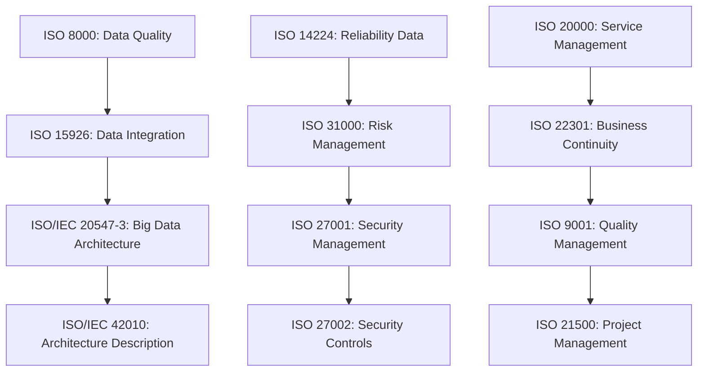

# ISO Standards Compliance Mapping - Aegrid

**Aegrid Asset Lifecycle Intelligence Platform**  
*Comprehensive ISO Standards Alignment with The Aegrid Rules*

---

## 📋 **Compliance Overview**

This document maps 13 ISO standards to Aegrid's core principles (The Aegrid Rules) and implementation phases, ensuring comprehensive compliance across architecture, security, data management, and operational excellence.

### **Implementation Phases**
- **Phase 1 (Immediate)**: Core asset management and security standards
- **Phase 2 (Short-term)**: Architecture and data management standards  
- **Phase 3 (Medium-term)**: Management and quality standards

---

## 🎯 **The Aegrid Rules Alignment**

### **Rule 1: Every Asset Has a Purpose → Function-Based Anchoring**

#### **Supporting ISO Standards**
- **ISO 8000** — Data Quality and Enterprise Master Data
  - *Alignment*: Ensures asset data quality and purposeful information
  - *Implementation*: Master data management for asset purposes and functions
  - *Benefit*: Clean, purposeful asset data supporting function-based modeling

- **ISO 15926** — Data Integration, Sharing, Exchange
  - *Alignment*: Comprehensive lifecycle information for asset purposes
  - *Implementation*: Data model for technical installations and components
  - *Benefit*: Rich asset lifecycle data supporting purpose identification

- **ISO 55000** — Asset Management Systems
  - *Alignment*: Asset management fundamentals supporting purpose-driven approach
  - *Implementation*: Asset management system requirements
  - *Benefit*: Structured approach to asset purpose definition and management

#### **Technical Implementation**
```cypher
// Graph query supporting Rule 1 with ISO 8000 data quality
MATCH (a:Asset)-[:HAS_PURPOSE]->(p:Purpose)
WHERE p.qualityScore >= 0.8 AND p.isValidated = true
RETURN a.name, p.function, p.serviceValue, p.businessImpact
```

---

### **Rule 2: Match Maintenance to Risk → Criticality-Driven Grouping**

#### **Supporting ISO Standards**
- **ISO 14224** — Reliability Data Collection and Exchange
  - *Alignment*: Risk-based maintenance data collection
  - *Implementation*: Equipment reliability data for risk assessment
  - *Benefit*: Data-driven risk analysis for maintenance decisions

- **ISO 31000** — Risk Management Principles
  - *Alignment*: Risk management framework for asset criticality
  - *Implementation*: Risk assessment and management processes
  - *Benefit*: Structured risk management supporting criticality-driven grouping

- **ISO 27002** — Information Security Controls
  - *Alignment*: Security controls for high-risk asset protection
  - *Implementation*: Security measures for critical asset systems
  - *Benefit*: Enhanced security for high-consequence assets

#### **Technical Implementation**
```cypher
// Graph query supporting Rule 2 with ISO 14224 reliability data
MATCH (a:Asset)-[:HAS_RISK]->(r:Risk)
WHERE r.criticality = "High" AND r.reliabilityData.isValid = true
RETURN a.name, r.failureMode, r.serviceImpact, r.maintenanceFrequency, r.riskScore
```

---

### **Rule 3: Protect the Critical Few → Visibility of Crown Jewels**

#### **Supporting ISO Standards**
- **ISO 27001** — Information Security Management Systems
  - *Alignment*: Security management for critical asset protection
  - *Implementation*: ISMS for critical asset security
  - *Benefit*: Comprehensive security framework for critical assets

- **ISO 27002** — Information Security Controls
  - *Alignment*: Detailed security controls for critical asset protection
  - *Implementation*: Specific security measures and controls
  - *Benefit*: Granular security controls for high-consequence assets

- **ISO 22301** — Business Continuity Management
  - *Alignment*: Continuity planning for critical asset resilience
  - *Implementation*: Business continuity for critical operations
  - *Benefit*: Ensures critical asset availability and resilience

- **ISO 20000** — IT Service Management
  - *Alignment*: Service management for critical asset operations
  - *Implementation*: ITSM for reliable critical asset services
  - *Benefit*: Reliable service delivery for critical assets

#### **Technical Implementation**
```cypher
// Graph query supporting Rule 3 with ISO 27001 security controls
MATCH (a:Asset)-[:HAS_CRITICALITY]->(c:Criticality)
WHERE c.level = "Critical" AND c.securityControls.isImplemented = true
RETURN a.name, c.reason, c.securityLevel, c.continuityPlan, c.escalationPath
```

---

### **Rule 4: Plan for Tomorrow, Today → Flexible, Future-Proof Models**

#### **Supporting ISO Standards**
- **ISO/IEC 42010** — Architecture Description
  - *Alignment*: Future-proof architecture documentation
  - *Implementation*: Architecture description framework
  - *Benefit*: Structured architecture supporting flexible modeling

- **ISO/IEC 20547-3** — Big Data Reference Architecture
  - *Alignment*: Scalable architecture for hybrid database systems
  - *Implementation*: Big data architecture for graph-based intelligence
  - *Benefit*: Scalable architecture supporting multiple hierarchies

- **ISO 21500** — Project Management Guidelines
  - *Alignment*: Structured project management for long-term planning
  - *Implementation*: Project management best practices
  - *Benefit*: Structured approach to future planning and implementation

- **ISO 9001** — Quality Management Systems
  - *Alignment*: Continuous improvement for future-proof systems
  - *Implementation*: Quality management for ongoing improvement
  - *Benefit*: Continuous improvement supporting future adaptability

#### **Technical Implementation**
```cypher
// Graph query supporting Rule 4 with ISO/IEC 42010 architecture views
MATCH (a:Asset)-[:BELONGS_TO]->(o:OrganizationalUnit)
MATCH (a)-[:VIEWABLE_BY]->(v:View)
WHERE v.type IN ["Operational", "Financial", "Compliance", "DigitalTwin"]
RETURN a.name, o.name, v.perspective, v.futureCompatibility, a.flexibilityScore
```

---

## 📊 **Phase-Based Implementation**

### **Phase 1 (Immediate) - Core Standards**

#### **ISO 14224: Reliability Data Collection**
- **Scope**: Equipment reliability data for risk-based maintenance
- **Implementation**: Data collection APIs, reliability metrics, failure mode analysis
- **Aegrid Rules**: Rule 2 (Match Maintenance to Risk)
- **Timeline**: Weeks 1-4

#### **ISO 55000: Asset Management Systems**
- **Scope**: Asset management system requirements and fundamentals
- **Implementation**: Asset management framework, governance, policies
- **Aegrid Rules**: Rule 1 (Every Asset Has a Purpose)
- **Timeline**: Weeks 1-8

#### **ISO 27001: Information Security Management**
- **Scope**: Information security management system
- **Implementation**: ISMS framework, security policies, risk management
- **Aegrid Rules**: Rule 3 (Protect the Critical Few)
- **Timeline**: Weeks 1-12

#### **ISO 27002: Information Security Controls**
- **Scope**: Detailed information security controls
- **Implementation**: Security control implementation, monitoring, compliance
- **Aegrid Rules**: Rule 3 (Protect the Critical Few)
- **Timeline**: Weeks 4-16

#### **ISO 31000: Risk Management**
- **Scope**: Risk management principles and guidelines
- **Implementation**: Risk management framework, assessment processes
- **Aegrid Rules**: Rule 2 (Match Maintenance to Risk)
- **Timeline**: Weeks 1-8

### **Phase 2 (Short-term) - Architecture & Data**

#### **ISO/IEC 42010: Architecture Description**
- **Scope**: Systems and software engineering architecture description
- **Implementation**: Architecture documentation, views, viewpoints
- **Aegrid Rules**: Rule 4 (Plan for Tomorrow, Today)
- **Timeline**: Weeks 8-16

#### **ISO/IEC 20547-3: Big Data Reference Architecture**
- **Scope**: Big data reference architecture for hybrid systems
- **Implementation**: Hybrid database architecture, data integration patterns
- **Aegrid Rules**: Rule 4 (Plan for Tomorrow, Today)
- **Timeline**: Weeks 12-20

#### **ISO 8000: Data Quality and Master Data**
- **Scope**: Data quality and enterprise master data standards
- **Implementation**: Data quality management, master data governance
- **Aegrid Rules**: Rule 1 (Every Asset Has a Purpose)
- **Timeline**: Weeks 16-24

#### **ISO 15926: Data Integration and Exchange**
- **Scope**: Data integration, sharing, exchange for lifecycle information
- **Implementation**: Data integration patterns, lifecycle data models
- **Aegrid Rules**: Rule 1 (Every Asset Has a Purpose)
- **Timeline**: Weeks 20-28

#### **ISO 20000: IT Service Management**
- **Scope**: IT service management for platform operations
- **Implementation**: ITSM processes, service delivery, support
- **Aegrid Rules**: Rule 3 (Protect the Critical Few)
- **Timeline**: Weeks 24-32

### **Phase 3 (Medium-term) - Management & Quality**

#### **ISO 21500: Project Management Guidelines**
- **Scope**: Project management guidelines for implementation
- **Implementation**: Project management processes, governance
- **Aegrid Rules**: Rule 4 (Plan for Tomorrow, Today)
- **Timeline**: Weeks 28-36

#### **ISO 9001: Quality Management Systems**
- **Scope**: Quality management systems for continuous improvement
- **Implementation**: QMS framework, continuous improvement processes
- **Aegrid Rules**: Rule 4 (Plan for Tomorrow, Today)
- **Timeline**: Weeks 32-40

#### **ISO 22301: Business Continuity Management**
- **Scope**: Business continuity management for platform resilience
- **Implementation**: BCM framework, continuity planning, disaster recovery
- **Aegrid Rules**: Rule 3 (Protect the Critical Few)
- **Timeline**: Weeks 36-44

---

## 🔄 **Cross-Standard Integration**

### **Data Flow Integration**


### **Aegrid Rules Integration Matrix**

| ISO Standard | Rule 1 | Rule 2 | Rule 3 | Rule 4 | Primary Focus |
|--------------|--------|--------|--------|--------|---------------|
| ISO 14224 | ⚪ | 🔴 | ⚪ | ⚪ | Risk-based maintenance |
| ISO 55000 | 🔴 | 🔴 | ⚪ | ⚪ | Asset management |
| ISO 27001 | ⚪ | ⚪ | 🔴 | ⚪ | Security management |
| ISO 27002 | ⚪ | ⚪ | 🔴 | ⚪ | Security controls |
| ISO 31000 | ⚪ | 🔴 | ⚪ | ⚪ | Risk management |
| ISO/IEC 42010 | ⚪ | ⚪ | ⚪ | 🔴 | Architecture |
| ISO/IEC 20547-3 | ⚪ | ⚪ | ⚪ | 🔴 | Big data architecture |
| ISO 8000 | 🔴 | ⚪ | ⚪ | ⚪ | Data quality |
| ISO 15926 | 🔴 | ⚪ | ⚪ | ⚪ | Data integration |
| ISO 20000 | ⚪ | ⚪ | 🔴 | ⚪ | Service management |
| ISO 21500 | ⚪ | ⚪ | ⚪ | 🔴 | Project management |
| ISO 9001 | ⚪ | ⚪ | ⚪ | 🔴 | Quality management |
| ISO 22301 | ⚪ | ⚪ | 🔴 | ⚪ | Business continuity |

**Legend**: 🔴 Primary alignment, ⚪ Secondary alignment

---

## 📈 **Compliance Metrics & KPIs**

### **Phase 1 Metrics**
- **ISO 14224**: Reliability data collection coverage (target: 95%)
- **ISO 55000**: Asset management system maturity level (target: Level 3)
- **ISO 27001**: ISMS implementation score (target: 85%)
- **ISO 27002**: Security controls implementation (target: 90%)
- **ISO 31000**: Risk management framework maturity (target: Level 3)

### **Phase 2 Metrics**
- **ISO/IEC 42010**: Architecture documentation completeness (target: 100%)
- **ISO/IEC 20547-3**: Big data architecture compliance (target: 95%)
- **ISO 8000**: Data quality score (target: 0.9+)
- **ISO 15926**: Data integration coverage (target: 90%)
- **ISO 20000**: Service management maturity (target: Level 3)

### **Phase 3 Metrics**
- **ISO 21500**: Project management maturity (target: Level 3)
- **ISO 9001**: Quality management system certification
- **ISO 22301**: Business continuity plan effectiveness (target: 95%)

---

## 🎯 **Success Criteria**

### **Overall Compliance Goals**
- **100%** of applicable ISO standards implemented
- **95%** compliance score across all standards
- **Zero** critical compliance gaps
- **Continuous** improvement processes established

### **Aegrid Rules Integration**
- **Rule 1**: 100% of assets have defined service purpose (ISO 8000, 15926)
- **Rule 2**: Risk-based maintenance schedules implemented (ISO 14224, 31000)
- **Rule 3**: Critical assets visible in all views (ISO 27001, 27002, 22301)
- **Rule 4**: Flexible modeling supports multiple views (ISO/IEC 42010, 20547-3)

---

## 📚 **Related Documentation**

- **[The Aegrid Rules](../core/aegrid-rules.md)** — Core principles
- **[PI2 Implementation Plan](TODO-PI2.md)** — Detailed implementation roadmap
- **[Hybrid Database Strategy](architecture/hybrid-database-strategy.md)** — Database architecture
- **[Service Blueprint](architecture/service-blueprint.md)** — Service overview

---

*Last Updated: January 2025*  
*Version: 1.0*  
*Status: PI2 Implementation Phase*
